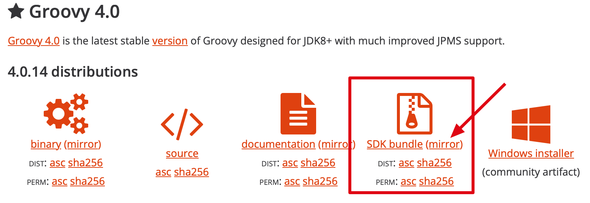

# 常用脚本

## clean-mvn-repository.groovy

用于清理本地 Maven 仓库中过时的 SNAPSHOT 文件 和 `.lastUpdated` 文件

1. 配置 Groovy 开发环境

- 下载 Groovy SDK：https://groovy.apache.org/download.html


- 配置环境变量 (macOS)

```bash
 export GROOVY_HOME=$HOME/groovy-4.0.14
 export PATH=$GROOVY_HOME/bin:$PATH
```

生效环境变量 `source .bash_profile`

- 测试配置

```bash
groovy -v
```

- 开始清理

```bash
groovy clean-mvn-repository.groovy
```

## gitpull.sh

批量更新当前目录下的所有 git 项目

在命令行运行脚本：
```bash
./gitpull.sh
```

## iTerm2Login.sh

用于 macOS 中 iTerm Terminal 工具自动登录脚本

使用方法：

1. 将 `iTerm2Login.sh` 脚本文件放到 `/usr/local/bin` 目录
2. 授权：`chmod a+x iTerm2Login.sh`
3. 打开 iTerm 并配置连接： Settings → Profiles → General
    - Command: Login Shell
    - Send text at start: ARGS='`port`|`user`|`ip`|`passwd`' iTerm2Login.sh

## iTerm2Tunnel.sh

用于 macOS 中 iTerm Terminal 工具使用跳板机登录到目标服务器

使用方法：

1. 将 `iTerm2Tunnel.sh` 脚本文件放到 `/usr/local/bin` 目录
2. 授权：`chmod a+x iTerm2Tunnel.sh`
3. 打开 iTerm 并配置连接： Settings → Profiles → General
    - Command: Login Shell
    - Send text at start: DEST='`port`|`user`|`ip`|`passwd`' JUMP='`port`|`user`|`ip`|`passwd`' iTerm2Tunnel.sh 

## ssh_tunnel.exp

用于 macOS 中 iTerm Terminal 工具使用跳板机登录到 FTP 服务器

使用方法：

1. 将 `ssh_tunnel.exp` 脚本文件放到 `/usr/local/bin` 目录
2. 授权：`chmod a+x ssh_tunnel.exp`
3. 打开 iTerm 并配置隧道连接： Settings → Profiles → General
    - Command: Login Shell
    - Send text at start: DEST='`port`|`ip`' JUMP='`port`|`user`|`ip`|`passwd`' ssh_tunnel.exp
4. 在 iTerm 中打开隧道连接
5. 打开 SFTP 客户端，并配置 FTP 连接： `ftp://localhost:$local_port`

## uhost.sh

用于 macOS 中更新 hosts 文件中的 github 地址

1. 将 `uhost.sh` 脚本文件放到 `/usr/local/bin` 目录
2. 授权：`chmod a+x uhost.sh`
3. 在命令行中运行：`uhost`, 即可完成更新